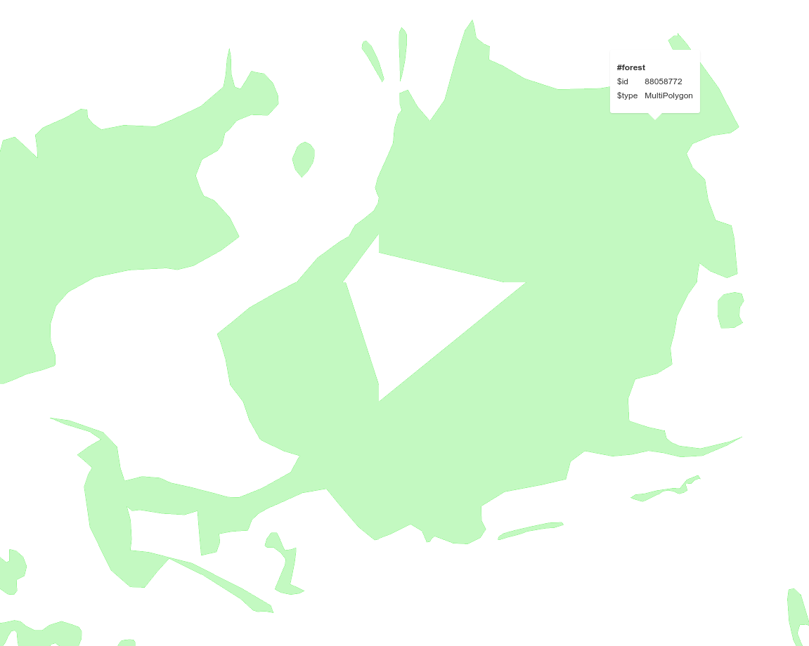

```
wget https://github.com/onthegomap/planetiler/releases/latest/download/planetiler.jar
```

## VW + midpoint smoother

Results in broken polygon here:

<a href="http://[::]:8080/data/pmtiles/#14.3/47.12837/7.97538">http://[::]:8080/data/pmtiles/#14.3/47.12837/7.97538</a>



Reproduce with `run-vw.sh`.
